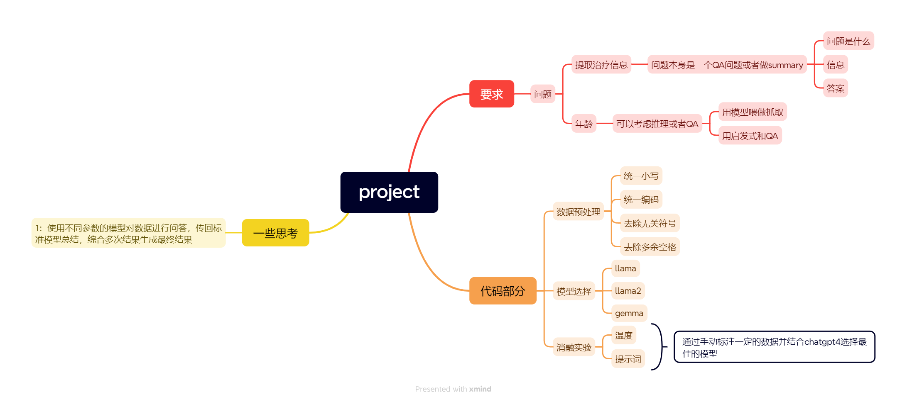

这是project的整体流程

根据项目要求，主要做了如下步骤：

  1：分析数据，得出年龄（如果有）和治疗信息分布在description和transcription中， 并发现数据中存在大小写，多余空格和无关符号。
  
  2：数据预处理，对数据进行统一编码，小写，消除多余空格等操作。
  
  3：选择模型：选择模型llama2，llama：7b，gemma:2b进行实验。
  
  4：消融实验：针对模型的温度和提示词设置了一系列不同的参数，通过手动标注了一定的数据结合chatgpt4后选取最佳的模型和总结未来可改进的方向。由于算力有限，消融实验只选取了前100条数据，llama和llama2分别选取了前500和前2000条数据。
  
  5：总结。

1:src主要放置了项目的.py文件和.ipynb文件，data中存放了原始数据和markdown的相关图片，doc中解释了所需要的全部库，和库ollama的布置和相关使用以及创建子模型的方法，result（cleaned_data;llama;llama2,llama2 Alab experiment）存放了各个部分的结果

2:对于ollama，需要先在本地布置并下载对应预训练模型，才能正常执行代码。
  
  具体方法：
  
  1：下载ollama：
    
    window：https://ollama.com/download/OllamaSetup.exe
    
    macos： https://ollama.com/download/Ollama-darwin.zip
   
    linux:  curl -fsSL https://ollama.com/install.sh | sh

  2: 下载对应模型：
    
    ollama run model_name

  3: 对于自定义温度的子模型：
    
    在命令端执行CLI:
          
          echo "FROM model_name" > Modelfile                     #model_name为父模型
          
          echo "PARAMETER temperature temp" >>Modelfile          #temp为自定义温度
          
          ollama create sub_model_name -f Modelfile              #sub_model_name为子模型名称

