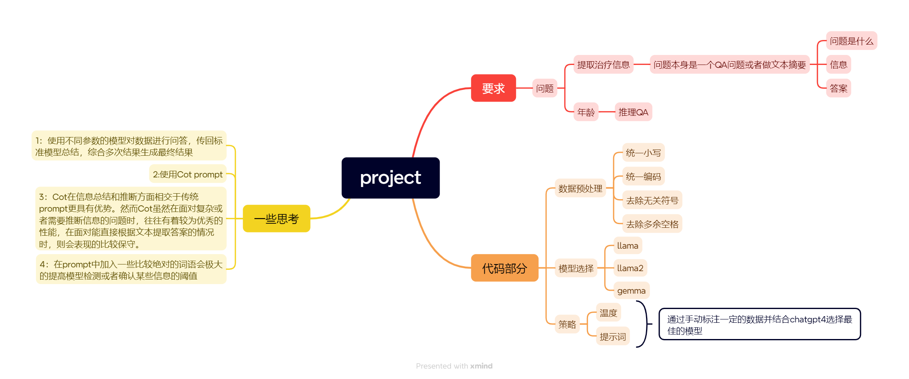
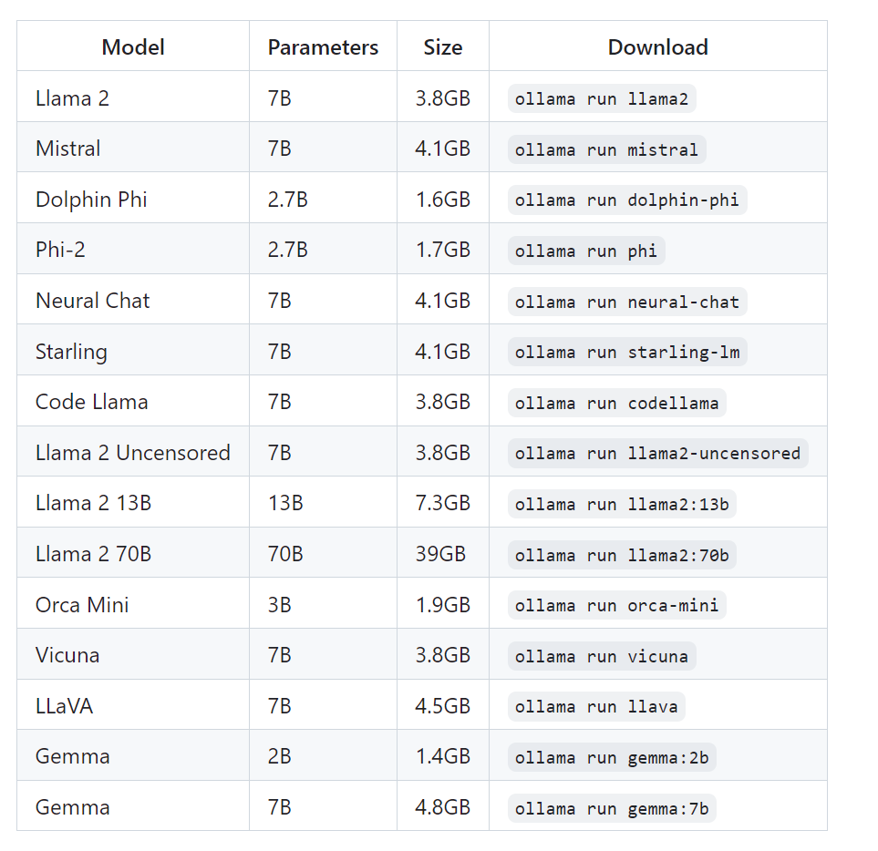
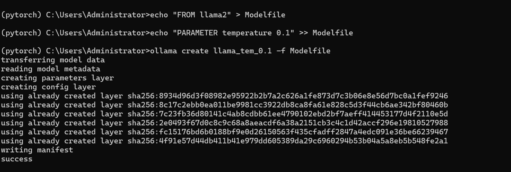

**入门测试**

This is the overall flow of the project.

Based on the project requirements, the following steps were primarily conducted:

  1:Analyzed the data, determining that age (if present) and treatment information are distributed in the description and transcription columns, and identified the presence of case sensitivity, extra spaces, and irrelevant symbols in the data.

  2:Preprocessed the data, including standardizing the encoding, converting to lowercase, and removing extra spaces.

  3:Model selection: Conducted experiments with models such as llama2, llama:7b, and gemma:2b.

  4:Strategy design: Set a series of different parameters for the model's temperature [0.1, 0.4, 0.7] and prompts, selected the best model and summarized future improvement directions after manually annotating some data combined with ChatGPT-4. Due to limited computational resources, the         ablation experiment only selected the first 100 data entries, while other experiments selected data from the first 500 to 1000.

    Parameter and model selection is as follows:

      model_list = ['gemma:2b','llama2',  'llama_tem_0.1', 'llama_tem_0.4', 'llama_tem_0.7']
 
      treatment_prompts = [   "Question: What patient treatment plan described in this text?",   
                              
                              "Question: Identify the treatment strategy for the patient's diagnosis." ]
 
      age_prompts = [   "Question: What is the patient's age based on this text?",   
                        
                        "Question: What is the patient's age based on this text? Tips: If there is a specific age mentioned in the text, just state 'The patient is X years old.' If the age is not explicit but can be inferred, state the possible age range and provide a brief reasoning. If it's not possible to determine, state 'Cannot determine the patient's age.'",   
                        
                        "Question: What is the patient's age based on this text? tip: Please answer very concisely. Example: the patient is 23 years old." ]

After manually annotating a small amount of data and using ChatGPT for selection, it was found that llama2 performed best under the following conditions:

       temp = 0.1
       
       t_prompt(treatment_prompt) = "Question: What patient treatment plan described in this text?"
       
       a_prompt(age_prompt) = "Question: What is the patient's age based on this text? tip: Please answer very concisely. Example: the patient is 23 years old."
         It's understandable that the performance is better under a temperature of 0.1 because both questions are text extraction QA problems. Except when the patient's age needs to be inferred, which introduces some randomness, excessive diversity in other cases can reduce the model's                conciseness and accuracy.

  For the two different parameters in treatment_prompt, the most important should be the difference between plan and strategy. The latter focuses on strategy, adding an analysis of the patient's condition to the actual answer.

  For age_prompts, the third parameter appeared because, under the first parameter, the answer still contained lengthy speculation and reasoning. However, in the second parameter of age_prompt, even obvious answers would be deduced as unable to find an accurate age and thus estimated.           Reducing absolute terms like specific and explicit in the prompts lessened but did not eliminate the tendency for inference.

  5:Optimization: Improved prompts using the Chain of thought method and recorded the results of each iteration.

  Using the Cot method, llama2's treatment information performance was better than the best parameters in section 4, while the age was not satisfactory.

    During the experiments, it was found that models, even when the text contains clear age information, tend to give an age range if they allow for guessing and inference in the prompts or text.

    The four versions of age_prompt had the following characteristics:

       a. Requires finding 'exact' age information, eventually 'estimating' age by synthesizing information
       
       b. Requires collecting age information, eventually 'estimating' age by synthesizing information

       c. Requires collecting age information and giving out the age

       d. Requires collecting information, giving direct age if it exists, otherwise inferring age. Requires 'concise' Q&A
         
  However, all four versions were unsatisfactory when facing direct age text but performed better than llama2 in section 4 for inherently inferential age information.
  
  6:Summary, Drawbacks, and Improvements:

      I. Due to limited computational power and time, many datasets were not fully tested. The ablation experiment only considered the top 10 results from all combinations.

      II. For the selection of combinations, a better method would be to write an automatic comparison function that refeeds the experimental results to the baseline model or other well-performing models, incorporating restrictions on the conditions for good models, allowing the model to               self-select. The author manually extracted labels from a small dataset for self-comparison and also fed it to ChatGPT-4 with restrictive conditions for judgment. Alternatively, the ROUGE score could be used for evaluation.

      III. For model improvement, based on point II, for complex or inferential questions, the questions could be fed to models with different parameters, and then the responses could be sent back to the baseline model for a comprehensive summary and final answer formulation.

      IV. Chain of thought (Cot) has advantages in information summarization and inference over traditional prompts. However, while Cot performs well when facing complex or inferential information needs, it tends to be conservative in situations where answers can be directly extracted from the text.

**Others**

  1:The src mainly contains the project's .py files and .ipynb files, data contains the original data and related markdown images, and doc explains all the required libraries, the setup and use of the ollama library, and the method for creating sub-models. The result directory (cleaned_data;      llama; llama2, llama2 Alab experiment) stores the results of various parts.

  2:For ollama, the corresponding pre-trained models must be set up and downloaded locally before the code can be executed. For more usage of ollama, see the original ollama project: ollama GitHub.

    methods:

    I:Download ollama:

      Windows: OllamaSetup.exe
      
      macOS:   Ollama-darwin.zip
      
      Linux:   Execute curl -fsSL https://ollama.com/install.sh | sh
      
Download the corresponding model:

    Execute ollama run model_name
    
    ollama supports models like those shown in the image below.

model list is shown as followed:

  

  3:For creating sub-models with custom temperatures, as ollama does not support passing temperature to the ollama API in generate, execute the following CLI commands to generate a sub-model:

    echo "FROM model_name" > Modelfile  # model_name is the parent model
    
    echo "PARAMETER temperature temp" >> Modelfile  # temp is the custom temperature
    
    ollama create sub_model_name -f Modelfile  # sub_model_name is the sub-model name

Success in creating a personalized sub-model is indicated as shown below:
  
