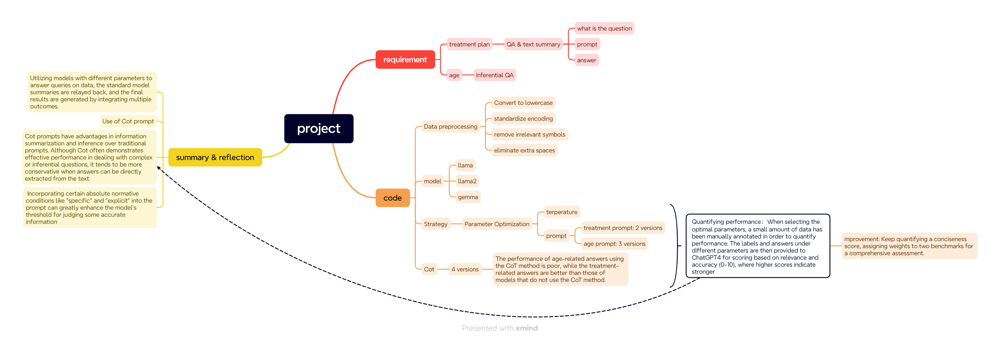

这是project的整体流程

根据项目要求，主要做了如下步骤：
  1：分析数据，得出年龄（如果有）和治疗信息分布在description和transcription中， 并发现数据中存在大小写，多余空格和无关符号。
  2：数据预处理，对数据进行统一编码，小写，消除多余空格等操作。
  3：选择模型：由于优秀的开源llm屈指可数，故选择模型llama2，llama。
  4：消融实验：针对模型的温度和提示词设置了一系列不同的参数，通过手动标注了一定的数据结合chatgpt4后选取最佳的模型和总结未来可改进的方向。
  5：总结。

